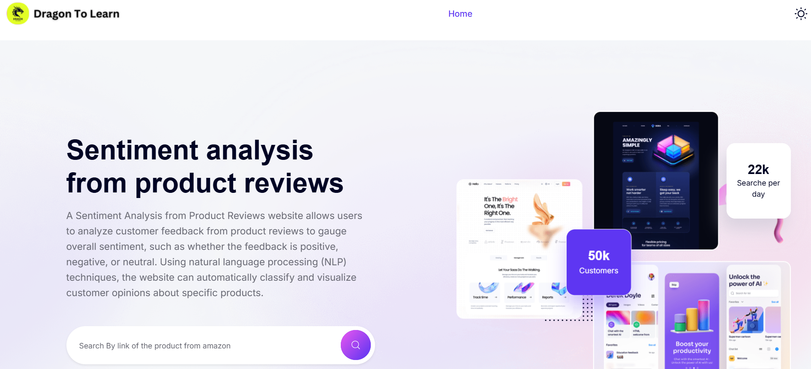
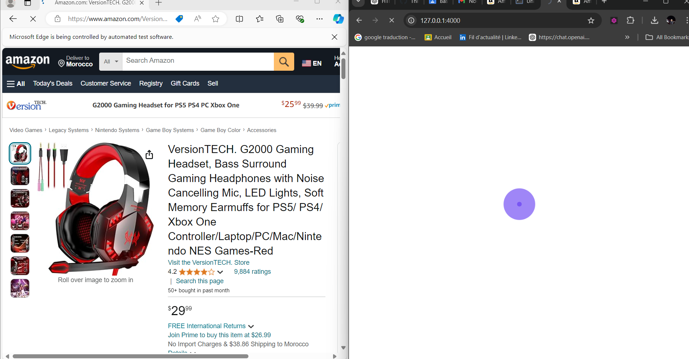
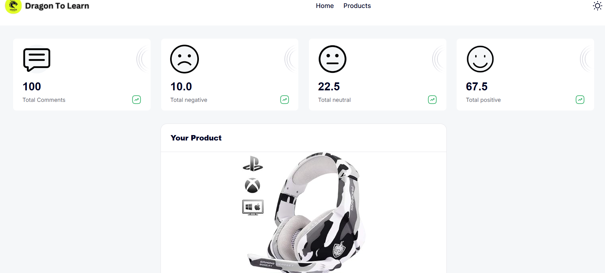
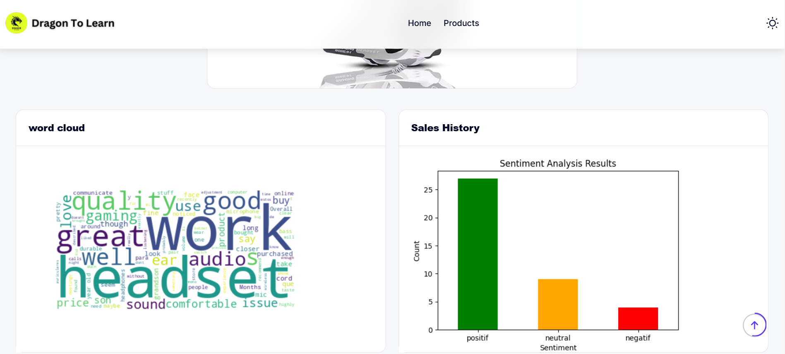
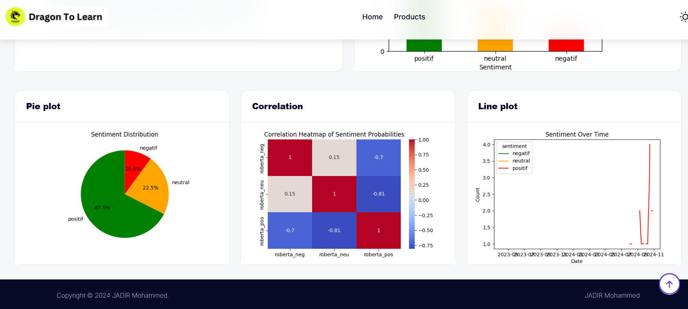

# Dragone to Learn by JADIR Mohammed
## sentiment analysis on products
This application performs sentiment analysis on products based on Amazon links.

## Features

This web application, built with Flask, uses the Roberto model from Hugging Face to predict sentiment analysis based on product comments from Amazon.

[](https://python.org)


### Screenshots

**Home Page:**


**Processing time (spinner):**



**Results :**






## Running the Project Locally

First, clone the repository to your local machine:

```bash
git clone https://github.com/Jadir99/Sentiment-analysis-from-product-reviews.git
```

Install the requirements:

```bash
pip install -r requirements.txt
```


Finally, run the development server:

```bash
python app.py
```

The project will be available at **127.0.0.1:4000**.


